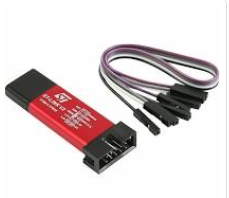
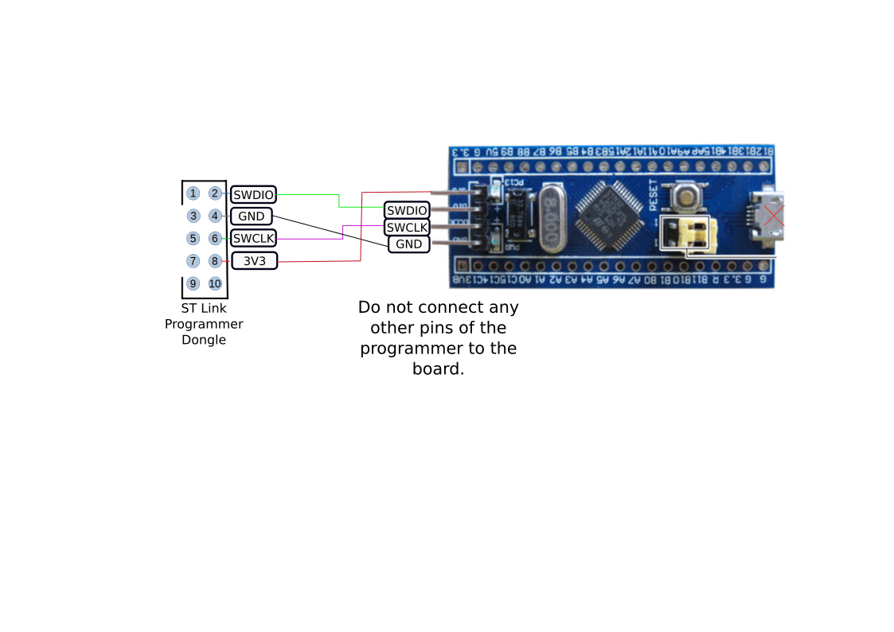

==== Connecting the STLink debugger.

The STLink V2 programmer is needed to flash the software image to the BluePill microcontroller 
board.

[#img-stlink]
.STLink Programmer

The STLink programmer should be connected to the blue-pill as shown in the following diagram.
[#img-stlinkconnection]
.STLink Programmer

